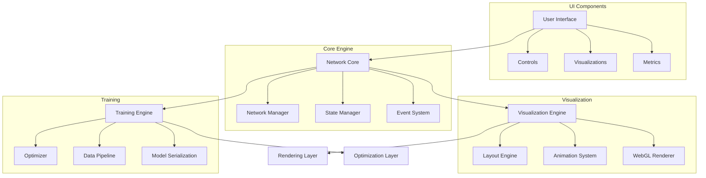
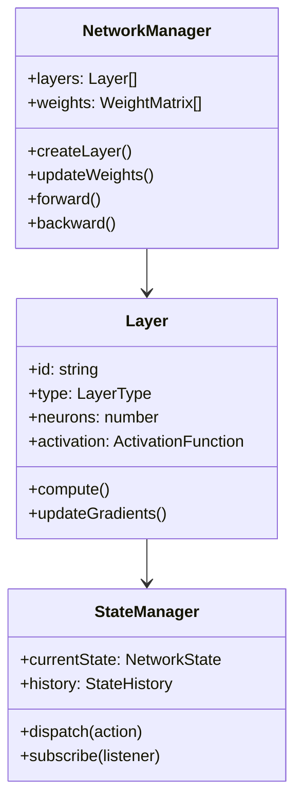
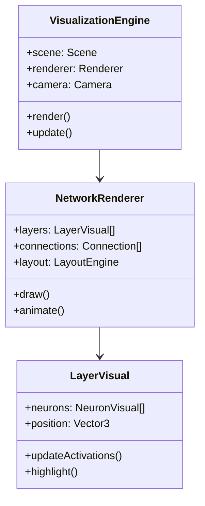
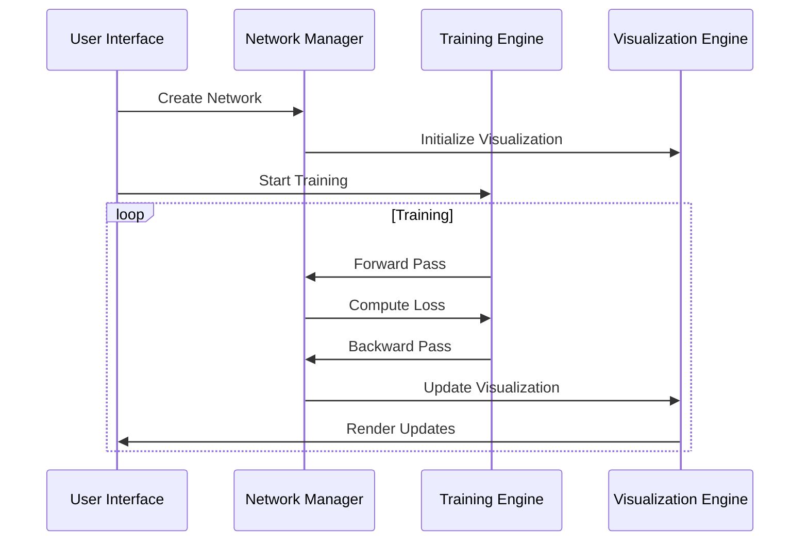
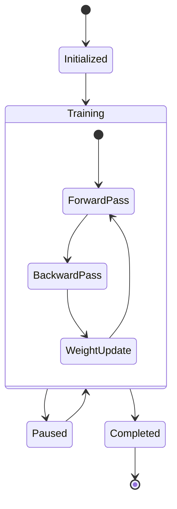
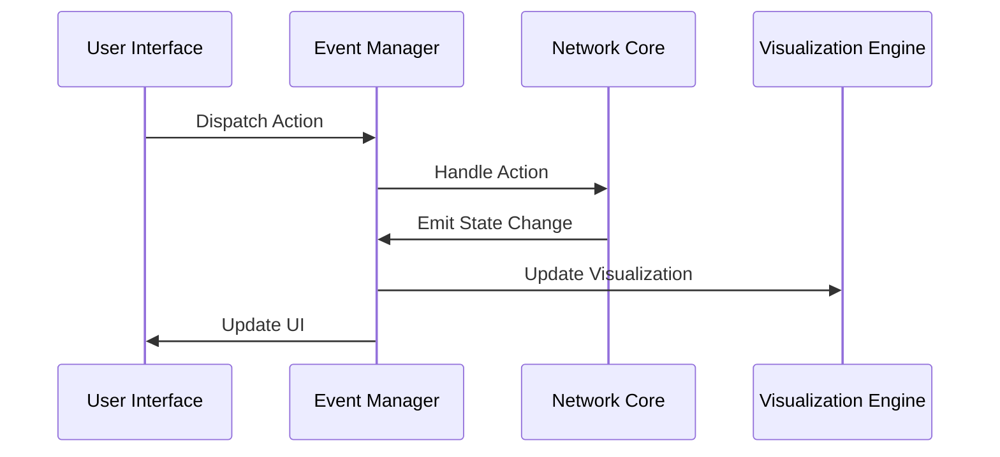
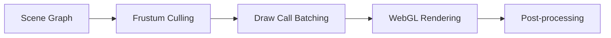
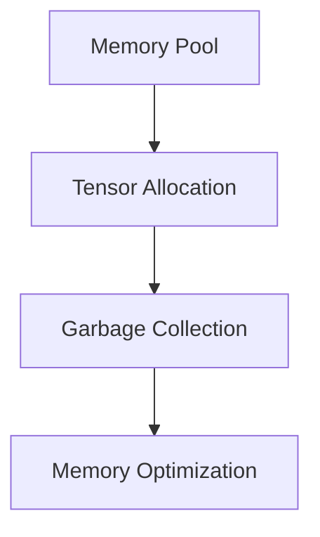

# Visu-Net Architecture Guide

This guide provides a detailed overview of the Visu-Net architecture, including component relationships, data flow, and implementation details.

## High-Level Architecture



## Component Architecture

### 1. Core Components



### 2. Visualization Components



## Data Flow



## Implementation Details

### 1. Network Core Implementation

```typescript
interface NetworkCore {
  layers: Layer[];
  state: NetworkState;
  
  // Layer Management
  addLayer(config: LayerConfig): void;
  removeLayer(id: string): void;
  
  // Training
  forward(input: Tensor): Tensor;
  backward(gradients: Tensor): void;
  
  // State Management
  saveState(): void;
  loadState(state: NetworkState): void;
}

interface Layer {
  id: string;
  type: LayerType;
  neurons: number;
  weights: WeightMatrix;
  
  // Computation
  forward(input: Tensor): Tensor;
  backward(gradients: Tensor): Tensor;
  
  // Visualization
  getVisualProperties(): VisualProps;
}
```

### 2. Visualization Engine Implementation

```typescript
interface VisualizationEngine {
  scene: Scene;
  renderer: WebGLRenderer;
  
  // Rendering
  initialize(container: HTMLElement): void;
  render(): void;
  
  // Updates
  updateNetwork(state: NetworkState): void;
  updateActivations(activations: number[][]): void;
  
  // Interactions
  handleHover(position: Vector2): void;
  handleClick(position: Vector2): void;
}

interface Scene {
  layers: LayerMesh[];
  connections: ConnectionMesh[];
  
  // Scene Management
  add(object: Object3D): void;
  remove(object: Object3D): void;
  
  // Layout
  updateLayout(): void;
}
```

## State Management



## Event System



## Performance Considerations

### 1. Rendering Pipeline



### 2. Memory Management



## Extensibility

### 1. Plugin System

```typescript
interface Plugin {
  name: string;
  version: string;
  
  // Lifecycle
  initialize(core: NetworkCore): void;
  cleanup(): void;
  
  // Functionality
  extend(extension: Extension): void;
}
```

### 2. Custom Layer Implementation

```typescript
interface CustomLayer extends Layer {
  // Custom properties
  parameters: CustomParameters;
  
  // Custom methods
  initialize(): void;
  compute(input: Tensor): Tensor;
  
  // Visualization
  getCustomVisuals(): CustomVisuals;
}
```

## Security Considerations

1. Data Validation
2. Input Sanitization
3. WebGL Context Security
4. Cross-Origin Resource Sharing

## Future Considerations

1. WebGPU Support
2. Distributed Training
3. Advanced Visualization Features
4. Real-time Collaboration 